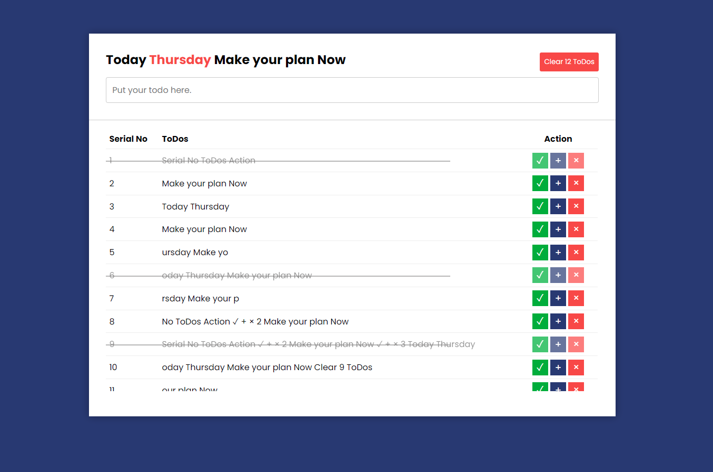

# Simple Todo Application for desktop

This is simple todo application in desktop not only desktop it also using of your tablet to get a better performance of this project. You also can use this project for your mobile phone but it's not recommend for you. basically if you wanna get better look using desktop. In this application you will add of your todo and also checkmark for completed all of the todo when you completed. and also has a edit button to edit of your todo and can delete as well

# Using Technologies
- HTML5/HTML
- CSS3/CSS
- Vanilla JavaScript.
- VS Code Editor
- Git bash / Github
- Dom Manipulations and many more

# Here is some demo screenshot about my project.

> Thanks for reach out me on github.